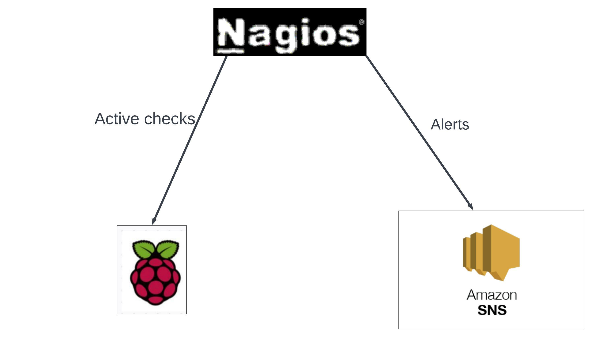

# Nagios EMAIL Alerts with Amazon SNS

## Integrated Nagios deployment with Amazon Simple Notification Service to deliver email messages when a host (magic jack )is down

Nagios is a powerful open-source monitoring and alerting system that allows you to monitor the state of various hosts and services. Amazon SNS is a fully managed notification service that can deliver notifications to a variety of endpoints.

In this project, we've set up Nagios to monitor hosts and services and configured it to send notifications to specific contacts using Amazon SNS when critical or warning states are detected.

## Architecture diagram



## Prerequisites

Before getting started, you'll need the following:

- Raspberry Pi. I installed Nagios on a Raspberry Pi 4 Model B
- [Nagios Core](https://www.nagios.org/) installed and configured on your server.Instructions on installing Nagios on a raspberry Pi can be found [here](https://pimylifeup.com/raspberry-pi-nagios/).
- An [Amazon Web Services (AWS)](https://aws.amazon.com/) account with access to Amazon SNS.

## Setup Instructions

1. Clone this repository to your Nagios server:

   git clone https://github.com/your-username/nagios-sns-monitoring.git

   ```
   cd nagios-sns-monitoring
   ```

2. Configure Nagios host and service definitions in your Nagios configuration files (in this case pimylifeuphost.cfg located at /usr/local/nagios/etc/objects/pimylifeuphost.cfg ). **Configuation files included in this repo**

3. Configure AWS SNS.

   ### Install AWS CLI

   First determine if raspberry pi is 32 bit or 64 bit.

   Open a terminal on your Raspberry Pi.Run the following command:

   ```
   uname -m
   ```

   This command will display the machine hardware name. If it shows aarch64, your Raspberry Pi is running a 64-bit operating system. If it shows armv7l or armv6l, your Raspberry Pi is running a 32-bit operating system.

   Instructions for install AWS CLI on a 32 bit OS can be found [here](https://docs.aws.amazon.com/cli/v1/userguide/install-linux.html).

   ### Configure AWS SNS

   Instructions on creating a Topic and publishing to that topic can be found [here](https://docs.aws.amazon.com/sns/latest/dg/sns-getting-started.html).

   Please note that currently **ONLY** US East 1 (N. Virginia region)supports SMS messaging.Meaning you need to create your topic in the (N. Virginia region).However you can publish to the SNS service from anywhere (i.e servers in the Ohio Region or even in your private datacenter (Raspberry Pi) will still work.)

   Once you create the topic copy the Topic ARN,Topic Name and Display Name.They will be used later.

   ### Configuring API Keys

   Go to IAM and create a user generating a new access key for the user as you do so. Copy the credentials you will need them for your script. Once you close this page you won’t be able to see them again.

   Now click your user and expand the “Inline Policy” section. We are going to grant the user the ability to Publish events to the topic we created earlier.

   Choose “Policy Generator.”

   Under AWS service choose Amazon SNS. Under “Actions” choose “List Topics.” For Amazon Resource Name enter “\*”. Click “Add Statement.”

   Under AWS service choose Amazon SNS. Under “Actions” choose “Publish.” Last, put the Topic ARN we copied earlier in the Amazon Resource Name box. Click “Add Statement.”

   Click “Next Step.”

   Apply your policy. Your user can now publish to the SNS topic.

4. Create a Bash Script:

- Open a text editor on your Nagios server, and create a Bash script. Let's call it notify-service-by-sns.sh. You can use the nano text editor or any other text editor you prefer:

  ```
  nano notify-service-by-sns.sh
  ```

- **Write the Bash Script**:
  In the Bash script, you'll use the AWS CLI to publish messages to an SNS topic. Here's an example script:

  ```
  #!/bin/bash

  # AWS SNS Topic ARN
  TOPIC_ARN="YOUR_SNS_TOPIC_ARN"

  # Set AWS credentials as environment variables
  export AWS_ACCESS_KEY_ID="AWS ACCESS KEY ID"
  export AWS_SECRET_ACCESS_KEY="AWS_SECRET_ACCESS_KEY"
  AWS_REGION="us-east-1"

  # Nagios macros for service and message
  SERVICE="$1"
  HOST="$2"
  MESSAGE="$3"

  # AWS CLI command to publish a message to an SNS topic

  aws sns publish  --region "$AWS_REGION" --topic-arn "$TOPIC_ARN" --subject "$SERVICE on $HOST" --message "Magic jack down"

  ```

  In this script:

  Replace "YOUR_SNS_TOPIC_ARN" with the actual ARN of your Amazon SNS topic. Replace "AWS ACCESS KEY ID" and "AWS_SECRET_ACCESS_KEY" with your access key and ID generated earlier.

  - **Make the Script Executable**:
    Make the script executable with the following command:

  ```
  chmod +x notify-service-by-sns.sh
  ```

  - **Script Ownership**:

  Check the ownership of the script. The owner of the script should be the user under which the Nagios process runs. By default, Nagios typically runs as the nagios user.

  ```
  ls -l /path/to/notify-service-by-sns.sh
  ```

  - **Nagios User and Group**:

  Identify the user and group under which the Nagios process runs. You can typically find this information in the Nagios configuration files (e.g., /usr/local/nagios/etc/nagios.cfg).

  Change the user and group ownership of notify-service-by-sns.sh to the Nagios user and group, you can use the chown command in the following format:

  ```
  sudo chown nagios:nagios /path/to/ notify-service-by-sns.sh
  ```

  Replace `/path/to/file_or_directory` with the actual path to the file or directory you want to change the ownership of. This command will change both the owner and group to `nagios`.

  **Test Execution**:

  As a test, you can try to execute the script as the Nagios user (or the user under which Nagios runs) to see if there are any permission issues:

  ```
  sudo -u nagios /path/to/notify-service-by-sns.sh "$SERVICEDESC$" "$HOSTNAME$" "$SERVICEOUTPUT$"
  ```

  Successful test should provide the below output.You should also receive an email alert.

  ```
  {
     "MessageId": "xxxxxxxxxx-xxxx-xxxx-xxxx-xxxxxxxxxxxx"
  }
  ```

5. Configure Notification Commands:

   - Define how Nagios should send notifications. This involves specifying the command used for the notification method. In the case email.

   - Modify your Nagios configuration to use this Bash script as the notification command. Here's how you can define the command in your `commands.cfg` file:

   ```
   define command {
      command_name    notify-service-by-sns
      command_line    /path/to/notify-service-by-sns.sh "$HOSTNAME$" "$SERVICEDESC$" "$SERVICESTATE$" "$SERVICEOUTPUT$"
   }
   ```

   Make sure to replace /path/to/notify-service-by-sns.sh with the actual path to your Bash script.The `commands.cfg` file is located in `/usr/local/nagios/etc/objects/commands.cfg`

   ### Verify Configuration:

   Check the configuration for errors using Nagios' configuration verification tool:

   ```
   sudo /usr/local/nagios/bin/nagios -v /usr/local/nagios/etc/nagios.cfg
   ```

   Replace the paths with the actual paths used in your installation. This command will validate your configuration files and report any errors.

   **Restart Nagios**: If there are no errors reported, restart Nagios to apply the new configuration:

   ```
   sudo systemctl restart nagios
   ```

   Now, Nagios will regularly perform ping checks on the specified host, and it will generate alerts based on the configured thresholds if the ping response times exceed the defined warning or critical values.

## Usage

With the configuration in place, Nagios will now use the notify-service-by-sns command to send notifications to the specified SNS topic when service states change. Adjust the thresholds and notification options to suit your monitoring needs.

## Troubleshooting

- If you encounter issues with notifications not being sent, check Nagios logs (/usr/local/nagios/var/nagios.log
  ) and AWS SNS for any error messages.

- Ensure that your AWS credentials are correctly configured, and permissions are set up for SNS usage.
